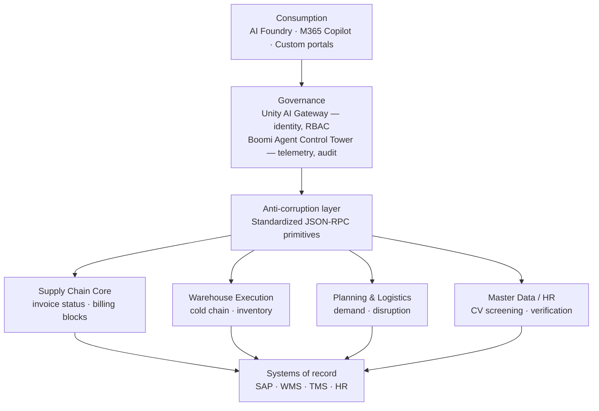

# Gunasegarran Magadevan

### AI &amp; Integration Solution Architect

**Integration complexity is a design choice — and so is removing it.**

---

## About

I build the digital foundation that lets enterprises scale, automate and innovate at speed. Twelve years as a Solution Architect and Integration Lead, spent turning integration complexity into operational efficiency — currently driving enterprise integration strategy and platform governance inside an AI &amp; Automation Factory and an Integration CoE.

I started in telco middleware, building SOAP and REST services on Mule 3 for SIM provisioning and carrier billing. The work looks different now — MCP servers, agent control towers, integration CoEs — but the question has not changed: how do two systems that were never designed to meet exchange data without anyone losing sleep.

The AI part is not a pivot. An agent is only as useful as the systems it can reach, and reaching systems safely is an integration problem with higher stakes. That is why my architecture work runs through a governance layer rather than around it.

| 🧩 `12+` | 🤖 `4+` | 🏢 `8` | 🎓 `22` | 📜 `4` |
|:--:|:--:|:--:|:--:|:--:|
| Years in integration | Years in AI | Roles held | Certifications | Degrees &amp; doctorate |

---

## 🧭 What I do

<table>
<tr>
<td width="50%" valign="top">

### 🏛️ Architecture
**Design that survives contact with the estate**

API-led, event-driven and microservice patterns chosen for the problem in front of me, then written down as standards other teams can follow without asking.

`API-led design` `Event-driven` `Microservices` `Design governance`

</td>
<td width="50%" valign="top">

### 🔗 Integration
**One governed path, not a mesh of direct calls**

Twelve years of moving data between systems that were never meant to meet — bancassurance, telco middleware, media platforms, global supply chain.

`Boomi` `SAP CPI` `Azure Integration Services` `WSO2` `MuleSoft`

</td>
</tr>
<tr>
<td width="50%" valign="top">

### 🤖 Agentic AI
**Agents that reach systems under supervision**

MCP as the protocol layer, an identity gateway and control tower in front of it, and a human review gate before anything touches a runtime.

`Model Context Protocol` `Boomi Agent Studio` `AI Foundry` `Local LLMs`

</td>
<td width="50%" valign="top">

### 🛡️ Governance
**Auditability is a feature, not paperwork**

Architecture review boards, reusable components and CI/CD quality gates, so scale does not arrive with a compliance bill attached.

`Review boards` `CI/CD gates` `Standards` `Audit compliance`

</td>
</tr>
</table>

---

## 🏗️ How I wire agents to enterprise systems

> The failure mode of enterprise agents is not weak models, it is ungoverned access.

---

## 🧰 Toolbox

| Domain　　　　　　　　 | Stack                                                                                                                     |
| ------------------------| ---------------------------------------------------------------------------------------------------------------------------|
| 🏛️ **Architecture**　　| API-led design · Event-driven architecture · Model Context Protocol · Microservices · Design governance                   |
| 🔗 **Integration**　　 | Boomi · SAP CPI · Azure Integration Services · MuleSoft · WSO2 · TIBCO · Oracle SOA · Axway B2Bi                          |
| ☁️ **Cloud &amp; data** | Azure · Databricks · GCP · Microsoft Fabric · Azure Data Factory · CosmosDB · Kubernetes                                  |
| 🤖 **AI**　　　　　　　| Boomi Agent Studio · Microsoft AI Foundry · Intelligent Document Processing · Salesforce Agentforce · Ollama / local LLMs |
| 💻 **Programming**　　 | Python · Node.js · TypeScript · Java · GraphQL                                                                            |
| 🚀 **Delivery**　　　　 | Azure DevOps · CI/CD · JIRA · Confluence · Agile · Vendor management                                                      |

---

## 🚀 Selected work

<table>
<tr>
<td width="50%" valign="top">

### 🕸️ HAVI One MCP
**Governance before capability**

Enterprise MCP architecture with three layers between an intent and a system: consumption, governance, execution — across four MCP domain servers.

`4 AI platform builds` · `115+ integrations` · `3 iPaaS governed`

</td>
<td width="50%" valign="top">

### 💎 TM Forum Open API
**From zero to Diamond**

Led 8 developers to build 50 TM Forum-compliant Open APIs, part of 74 certified in total. Diamond Certification, global top 3 on the conformance list.

`74 certified APIs` · `30 outsourced devs managed`

</td>
</tr>
<tr>
<td width="50%" valign="top">

### ☁️ Boomi out, Azure in
**Migration to decommission**

Ran the full Boomi to Azure migration end to end and decommissioned Boomi with minimal downtime, licences cancelled. Final approver on every MuleSoft deliverable for The Grid.

`Azure Integration Services` `MuleSoft`

</td>
<td width="50%" valign="top">

### 📰 REV Media transformation
**Four platforms, one year**

FMT migrated to Google Cloud, four WSM apps consolidated, Business Times launched, Tonton rebuilt to streaming-grade standards.

`16-person team` · `~30% fewer deployment errors`

</td>
</tr>
<tr>
<td width="50%" valign="top">

### 🏦 PBDirect 2.0
**Bancassurance modernization**

A secure, scalable sales journey shared by AIA Bhd and Public Bank Bhd on Java Spring Boot, MSSQL and Software AG ESB, across multi-layered networks and load balancing.

`Java Spring Boot` `MSSQL` `Software AG ESB`

</td>
<td width="50%" valign="top">

### 🧊 Neural Rubik's
**MSc thesis**

Taught a neural network to estimate its own search heuristic for the cube, compared against admissible and inadmissible rules. The learned heuristic wins, and wins cheaply.

`Neural networks` `Heuristic search`

</td>
</tr>
</table>

---

## 📜 Education

| Award　　　　　　　　　　　　　　　　　　　　　　| Institution                       | Period      |
| --------------------------------------------------| -----------------------------------| -------------|
| 🎓 Doctor of Business Administration — AI focus　| UNITAR International University   | 2024 — 2027 |
| 🧠 Master of Data Science — ML / Neural Networks | University of Malaya              | 2018 — 2020 |
| 💻 BSc Computer Science — Networking　　　　　　 | Management and Science University | 2012 — 2015 |
| 🔐 Diploma in Computer Forensics — Cryptography　| Management and Science University | 2010 — 2012 |

---

**[LinkedIn](https://www.linkedin.com/in/gunasegarran)** · **[guna3006@me.com](mailto:guna3006@me.com)**

